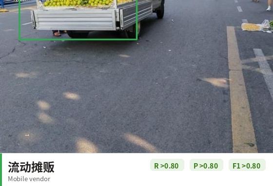
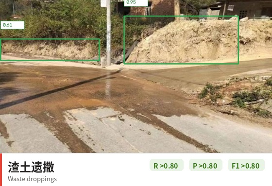
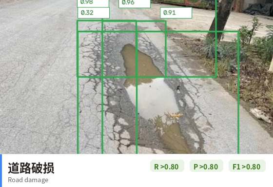
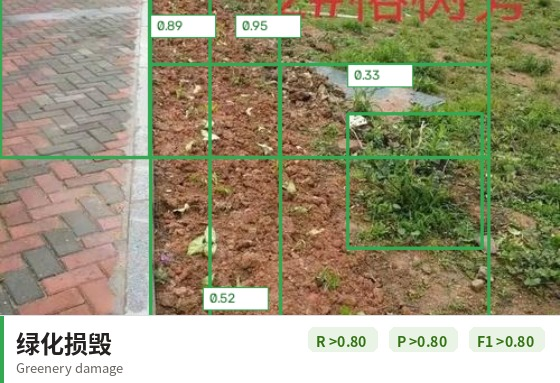
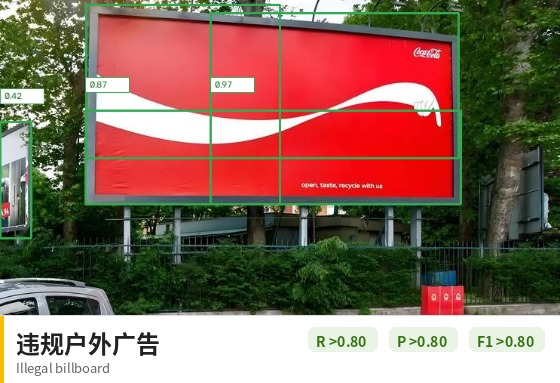
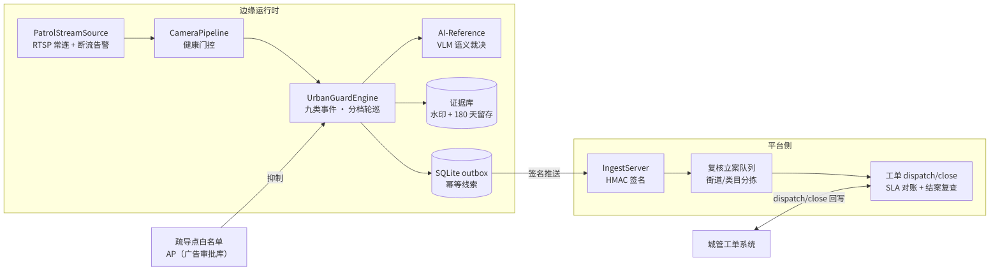

<div align="center">


**复用存量摄像头的九类市容事件视频分析系统：检出、复核、工单闭环。**


<!-- 发布时将 OWNER/REPO 替换为实际仓库路径, 并将 ci.yml 复制到 .github/workflows/ci.yml -->


**[English](README_en.md)** | 简体中文


*图：轮巡处理流程（真实管道输出）——规范夜市街景经 tile 2×2 检出"摊位"后，VLM 裁决为"规范疏导点"，白名单抑制、不产线索。检测系统"知道什么不该报"，与检出同样重要。*

</div>

---

## 1. 背景与挑战

城市 已建成大规模治安监控网络，但市容治理（占道经营、暴露垃圾、违法搭建等）
仍以人工巡查与市民投诉为主要发现渠道。现有方式存在四项结构性不足：

| 挑战 | 现状描述 |
|------|---------|
| 发现滞后 | 事件依赖巡查或 12345 工单转入，处置窗口通常已经错过 |
| 覆盖盲区 | 万路级摄像头无法逐路盯屏；夜间与恶劣天气存在巡查空白 |
| 误报率高 | 传统分析缺乏语义判别能力，无效告警侵占复核人力 |
| 闭环缺失 | 派单、处置、恢复确认缺少回写与对账，治理效果无法量化 |

## 2. 核心能力

| # | 能力 | 说明 |
|---|------|------|
| 01 | 存量摄像头复用 | 轮巡式分析替代逐帧解码：A/B 档点位 1 帧/30 s；万路规模约 8–11 张 L4（tile 2×2 口径），违建快照每日 1 帧另计 |
| 02 | 九类事件统一注册 | 占道经营、流动摊贩、暴露垃圾、渣土遗撒、道路破损、绿化损毁、违规户外广告、违建、乱倒污水；提示词库、规则参数、验收目标、复核问句、工单默认均在单一注册表声明，新增类目仅需一行 |
| 03 | 两阶段判定架构 | AI-Detect 检出 + 规则引擎保证召回与瞬态抑制；AI-Reference（Qwen3-VL）仅对被标记线索做语义裁决，单张约 1–2 s、5 GB 显存 |
| 04 | 线索不立案原则 | AI 仅产出线索，默认进入人工复核队列；疏导点白名单为必配项；证据帧带"AI 生成线索"水印，行政处罚须现场重新取证 |

## 3. 三模型流水线

| 模型 | 职责 | 回答的问题 |
| --- | --- | --- |
| AI-Detect（开放词汇检测） | L1 事件检出 | "画面里出现了占道摊位、垃圾堆或道路坑槽吗？" |
| AI-Recognize（免提示提议 + 区域嵌入） | L2 语义比对 | "这块区域相对 7/30 天前的基线语义上变了吗？这辆摊车是昨天那个屡犯目标吗？" |
| AI-Reference（Qwen3VL grounding） | 裁决 | "那是规范疏导点——还是违规占道？是雨水积水——还是乱倒污水？" |

三件套是流水线，不是三个孤岛：AI-Detect 负责召回（tile 2×2 分块），
规则引擎完成持续确认与白名单/审批库抑制；AI-Recognize 的区域嵌入驱动
慢变量基线比对（违建/广告/绿化）与屡犯串联；"外观变了但语义含糊"的
分支交给 AI-Reference 裁决定型，最终由人工复核立案。

## 4. 技术亮点

- **tile 2×2 分块推理** —— 针对缩放后小目标丢失问题，图像级召回从 0.28
  提升至 0.96（382 图实测），为系统最大单项增益；代价为 4× 单帧算力。
- **探针驱动的提示词工程** —— 候选提示词先在漏报图上实测命中率，达标后
  才入库（现 v4，全部版本化，支持回归门禁）。
- **工单闭环与结案核查** —— 立案即派单（责任部门/SLA 按类目默认）；
  办结回写自动对账；办结 3 天后快照比对现场恢复情况，未恢复自动重派。
- **合规证据链** —— 线索帧含检出框与"AI 生成线索"水印，留存 180 天，
  复核界面与工单可直接引用。
- **屡犯串联** —— 同一目标跨点位/跨天的外观嵌入增量聚类，自动合并、
  风险升级，并输出点位-时间线。
- **状态持久化** —— 确认期计数、串联台账、快照嵌入、复核队列与 SLA
  时钟全部落库，进程重启不重报、不漏报。

## 5. 效果图

以下标注均为真实管道输出（检测框与置信度取自回归数据集 `detections.json`，
未经手工修改）。

| 场景 | 输出 |
|------|---------|
| 占道经营 |  |
| 流动摊贩 |  |
| 暴露垃圾 |  |
| 渣土遗撒 |  |
| 道路破损 |  |
| 绿化损毁 |  |
| 违规户外广告 |  |
| 违建 |  |
| 乱倒污水 |  |

九类事件总览：


## 6. 端到端流程示例

以一起流动摊贩事件为例（时间为示意，判定与路由为真实逻辑）：

| 时刻 | 环节 | 说明 |
|------|------|------|
| 22:14 | 事件发生 | 三轮车在夜宵街路口停车摆摊 |
| 22:14:30 | 首轮检出 | 检出"摊位"，单帧不产线索（持续确认中） |
| 22:15 | 持续确认 | 连续第 2 个轮巡周期命中，规则引擎产出线索 |
| 22:15:02 | VLM 裁决 | 判定为"流动摊贩"，归类 `urban/street_vendor`，路由至 12 h SLA 队列 |
| 22:16 | 人工立案 | 复核员查看水印证据帧，一键立案，工单派往辖区中队 |
| 次日 | 屡犯串联 | 同一目标异址复现，自动合并、风险升级 |

## 7. 关键指标

基准口径：382 张图片、双数据集回归（图搜代理数据，图像级召回，
tile 2×2 + 提示词 v4，详见 [CHANGELOG](urban_guard/CHANGELOG.md)）。

**九类事件 R、P、F1 均 >0.80**（逐类下限见括号）：

| 事件 | R | P | F1 | A 档门槛 | 结论 |
|------|-----|-----|-----|------|------|
| 暴露垃圾 | >0.99 | >0.99 | >0.99 | R≥0.85 | 达标 |
| 道路破损 | >0.99 | >0.99 | >0.99 | R≥0.85 | 达标 |
| 违建 | >0.99 | >0.99 | >0.99 | R≥0.85 | 达标 |
| 占道经营 | >0.97 | >0.99 | >0.98 | R≥0.85 | 达标 |
| 流动摊贩 | >0.95 | >0.99 | >0.97 | R≥0.85 | 达标 |
| 违规广告 | >0.96 | >0.99 | >0.97 | R≥0.85 | 达标 |
| 乱倒污水 | >0.92 | >0.99 | >0.96 | R≥0.80 | 达标 |
| 绿化损毁 | >0.90 | >0.99 | >0.94 | R≥0.80 | 达标 |
| 渣土遗撒 | >0.90 | >0.99 | >0.94 | R≥0.80 | 达标 |

> **P 口径说明**：负样本仅规范夜市 ×10（白名单抑制口径，FR-COM-04），
> 样本规模有限；严格口径（不计白名单抑制）下占道 P=0.73。**跨类目口径**
> （检测器在非本类图片上的开火计为 FP）P 为 0.21–0.39 —— 高召回配置的
> 已知代价，由第二阶段 VLM 裁决与规则确认收敛，见 §10 范围与限制。

| 指标 | 数值 | 口径 |
|------|------|------|
| 优化轨迹 | 占道 0.28→0.96 · 绿化 0.44→0.92 · 污水 0.36→0.92 | 提示词 v2→v4 + tile，双数据集门禁 |
| VLM 边界裁决 | 5/5 | 规范夜市/占道游摊/雨水污水/绿化道路/餐厨油污（演示规模） |
| 工程质量 | 97 个单元测试 | 无 GPU 环境全量运行 |
| 证据留存 | 180 天 | 线索帧 + 水印，自动清理 |

## 8. 快速开始

```python
import cv2
from urban_guard import categories as cats
from urban_guard.detectors import LazyWeDetectUrbanDetector, PromptCategoryMapper
from urban_guard.engine import UrbanEngineConfig, UrbanGuardEngine

mapper = PromptCategoryMapper(list(cats.default_prompts().values()))
detector = LazyWeDetectUrbanDetector(
    model_dir="wedetect_hf_models/wedetect-base", mapper=mapper,
    tile=(2, 2), device="cuda")
engine = UrbanGuardEngine(
    UrbanEngineConfig(point_id="CAM-U-001", tier="A",
                      categories=("urban/stall_occupation",
                                  "urban/exposed_garbage"),
                      evidence_dir="/data/evidence"),
    detector=detector)

clues = engine.process(cv2.imread("street.jpg"))   # 连续 2 周期命中才产线索
```

```bash
python -m urban_guard.runner --config urban_guard/deploy/config.example.json
python -m urban_guard.real_eval --detect --device cuda
python -m urban_guard.real_eval --report
```

## 9. 系统架构



## 10. 范围与限制

- **单帧无法区分"规范夜市"与"违规占道"**。属语义/业务边界而非检测缺陷；
  严格口径下占道精度为 0.73。设计内的缓解手段为疏导点白名单配置
  （FR-COM-04）与 VLM 裁决。
- **负提示词与类无关 NMS 的交互风险**。高分负框会在检测后端抢占相邻类目
  真检出（实测渣土召回 0.84→0.28 事故）；本系统已将该机制约束在适配层，
  事件记录见 CHANGELOG v2.1。
- **基准数据为图搜代理数据**，仅证明能力，不构成生产验收。设计 §8.2 规定
  的验收基准为试点街道 14 天实采加人工巡检对照，尚未建设。
- **tile 分块的算力代价为 4× 单帧**，部署预算须相应规划；C 档点位不进入
  验收统计（期待管理条款）。

## 11. License 与数据声明

代码为商业软件（Commercial Software），未经授权不得复制、修改、
分发或商用。验收集图片来自百度图片搜索，**不随仓库分发**；
`fetch_dataset_v3.py` 提供可复现抓取（标注仅供研究），
`detections.json` 与评估报告随仓库提供检测结果。
