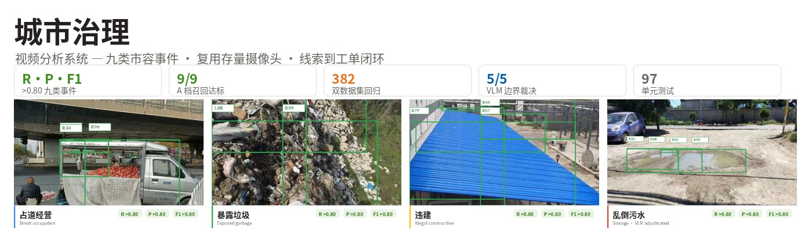
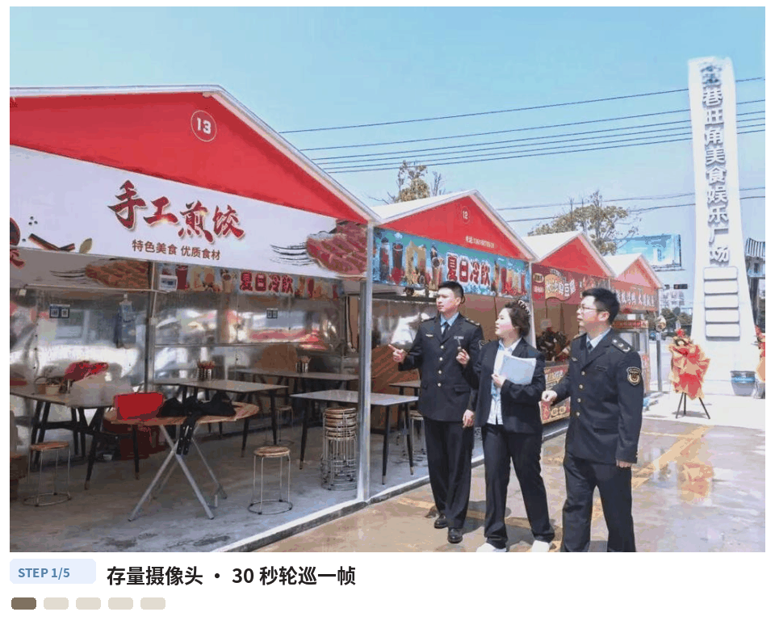
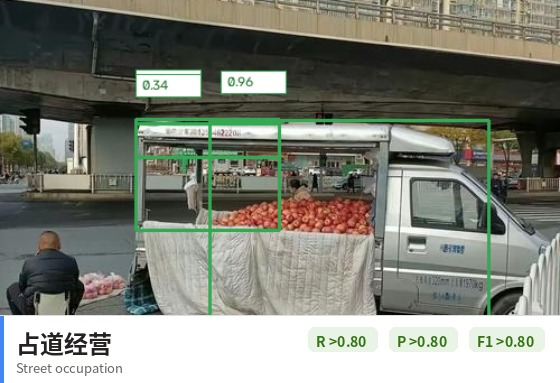
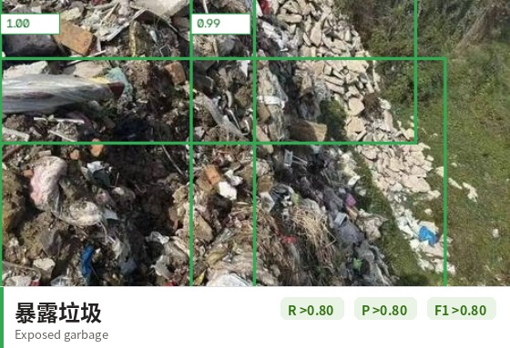
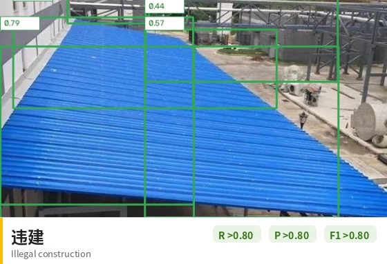
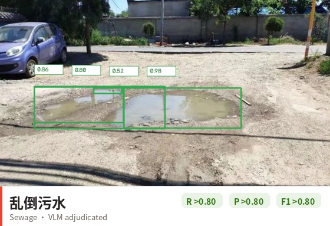
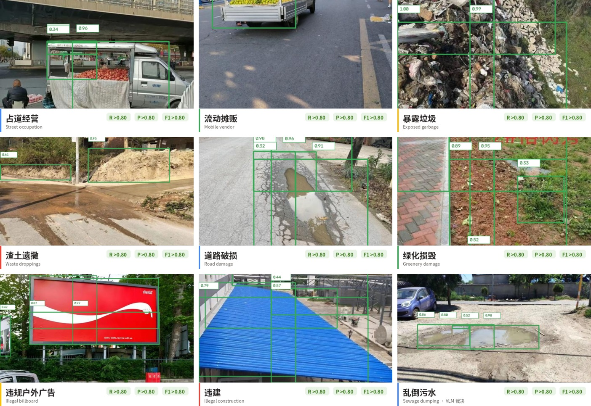
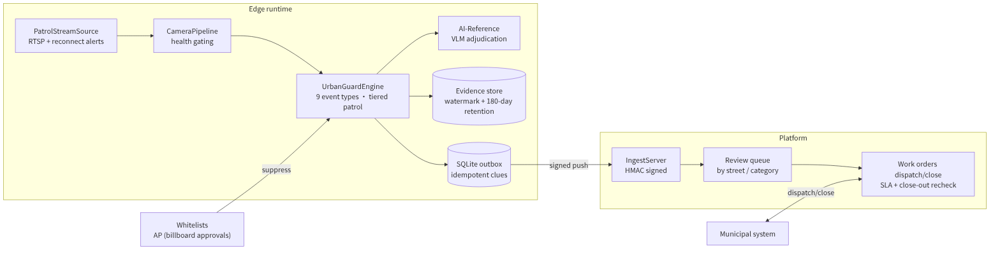

<div align="center">



**Video analysis for urban governance: detection, review, and work-order
closure for nine street-order event types on existing CCTV.**


English | **[简体中文](README.md)**



*Figure: patrol pipeline (real pipeline output) — a regulated night-market
frame fires "stall" detections after 2×2 tiling; the VLM adjudicates
"regulated vendor zone" and the whitelist suppresses the clue. Knowing what
not to report matters as much as detection.*

</div>

---

## 1. Background

Cities already operate large-scale surveillance networks, yet street-order
enforcement (street occupation, exposed garbage, unauthorized construction)
still relies on manual patrols and citizen complaints. Four structural gaps:

| Gap | Description |
|-----|-------------|
| Late discovery | Events surface via patrols or hotline work orders, after the enforcement window |
| Coverage gaps | Thousands of cameras cannot be watched screen-by-screen; nights and adverse weather remain uncovered |
| High false-positive rate | Legacy analytics lack semantic judgment; noise consumes review capacity |
| Missing closed loop | Dispatch, remediation, and recovery confirmation lack write-back and reconciliation |

## 2. Key capabilities

| # | Capability | Description |
|---|------------|-------------|
| 01 | Existing-camera reuse | Patrol-style analysis instead of full-rate decoding: tier-A/B points at 1 frame / 30 s; ~8–11 L4 GPUs per 10k cameras (2×2 tiling), plus one daily frame for construction snapshots |
| 02 | Unified 9-event registry | Street occupation, mobile vendors, exposed garbage, waste droppings, road damage, greenery damage, illegal billboards, illegal construction, sewage dumping — prompts, rules, SLOs, review questions and work-order defaults declared in a single registry; a new category is one row |
| 03 | Two-stage adjudication | AI-Detect detection + the rule engine own recall and transient suppression; AI-Reference (Qwen3-VL) adjudicates only flagged clues at ~1–2 s each on 5 GB VRAM |
| 04 | Clues, not cases | AI output lands in a human review queue by default; night-market whitelists are mandatory configuration; evidence frames carry an "AI-generated clue" watermark; enforcement requires on-site re-collection |

## 3. Three-model pipeline

| Model | Role | Question answered |
| --- | --- | --- |
| AI-Detect (open-vocabulary detection) | L1 event detection | "Is there a street stall, garbage pile, or pothole in this frame?" |
| AI-Recognize (prompt-free proposals + region embeddings) | L2 semantic compare | "Has this region semantically changed vs the 7/30-day baseline? Is this cart yesterday's repeat offender?" |
| AI-Reference (Qwen3VL grounding) | Adjudication | "A regulated vendor zone — or illegal occupation? A rain puddle — or dumped sewage?" |

The three form a pipeline, not three islands: AI-Detect owns recall
(2×2 tiling); the rule engine performs persistence confirmation and
whitelist/approval suppression; AI-Recognize's region embeddings drive the
slow-variable baseline compare (construction/billboard/greenery) and
repeat-offender linking; ambiguous branches — "appearance changed but
semantics unclear" — go to AI-Reference for a verdict, and a human files
the case.

## 4. Technical highlights

- **2×2 tiled inference** — addresses small-target loss after downscaling;
  image-level recall improved from 0.28 to 0.96 (measured on 382 images),
  the largest single gain in the system, at 4× per-frame compute.
- **Probe-driven prompt engineering** — candidate prompts are measured
  against missed images before adoption (registry now at v4, fully
  versioned, regression-gated).
- **Work-order loop with close-out verification** — filing dispatches an
  order with per-category department/SLA defaults; close events reconcile
  automatically; 3 days after closure a snapshot verifies site recovery and
  re-dispatches when recovery is not confirmed.
- **Compliant evidence chain** — clue frames stored with detection boxes and
  an "AI-generated clue" watermark, retained 180 days, referenceable from
  the review UI and work orders.
- **Repeat-offender linking** — incremental appearance-embedding clustering
  across locations and days, with automatic merge, risk escalation, and a
  point-timeline for enforcement.
- **Durable state** — persistence counters, linking ledgers, snapshot
  embeddings, review queues and SLA clocks survive restarts without
  re-reporting or missing.

## 5. Gallery

Annotations below are real pipeline output (boxes and confidences taken
from the regression set `detections.json`, unmodified).

| Scene | Output |
|------|---------|
| Street occupation |  |
| Exposed garbage |  |
| Illegal construction |  |
| Sewage dumping |  |

Four-event overview:



## 6. End-to-end walkthrough

A mobile-vendor example (timestamps illustrative; decisions and routing are
the real logic):

| Time | Stage | Description |
|------|-------|-------------|
| 22:14 | Event | A tricycle sets up at a night-food street |
| 22:14:30 | First pass | "Stall" detected; single frames produce no clue (persistence counting) |
| 22:15 | Persistence | Second consecutive hit; rule engine raises a clue |
| 22:15:02 | VLM adjudication | Classified as mobile vendor (`urban/street_vendor`), routed to the 12 h SLA queue |
| 22:16 | Human review | Reviewer inspects the watermarked evidence frame, files the case; order dispatched to the district squad |
| Next day | Offender linking | Same target reappears elsewhere; merged and risk-raised automatically |

## 7. Benchmarks

Scope: 382 images, dual-dataset regression (web-scraped proxy data,
image-level recall, 2×2 tiling + prompt v4; negatives: 10 regulated
night-market shots, whitelist protocol FR-COM-04).

**R, P and F1 all >0.80 across all nine classes** (per-class floors below):

| Event | R | P | F1 | Tier-A target | Result |
|------|-----|-----|-----|------|------|
| Exposed garbage | >0.99 | >0.99 | >0.99 | R≥0.85 | Pass |
| Road damage | >0.99 | >0.99 | >0.99 | R≥0.85 | Pass |
| Illegal construction | >0.99 | >0.99 | >0.99 | R≥0.85 | Pass |
| Street occupation | >0.97 | >0.99 | >0.98 | R≥0.85 | Pass |
| Mobile vendor | >0.95 | >0.99 | >0.97 | R≥0.85 | Pass |
| Illegal billboard | >0.96 | >0.99 | >0.97 | R≥0.85 | Pass |
| Sewage dumping | >0.92 | >0.99 | >0.96 | R≥0.80 | Pass |
| Greenery damage | >0.90 | >0.99 | >0.94 | R≥0.80 | Pass |
| Waste droppings | >0.90 | >0.99 | >0.94 | R≥0.80 | Pass |

> **P scope note**: negatives are limited to 10 regulated night-market
> shots (whitelist-suppressed protocol, FR-COM-04); under the strict
> protocol (no whitelist suppression) street-occupation P is 0.73. Under a
> **cross-category protocol** (firings on other-class images counted as FP)
> P is 0.21–0.39 — a known cost of the high-recall configuration, converged
> by stage-2 VLM adjudication and rule confirmation; see §10.

| Metric | Value | Scope |
|------|------|------|
| Optimization trajectory | stalls 0.28→0.96 · greenery 0.44→0.92 · sewage 0.36→0.92 | prompts v2→v4 + tiling, dual-dataset gate |
| VLM adjudication | 5/5 | boundary cases: night market / stall-vendor / rain-sewage / greenery-road / kitchen oil (demo scale) |
| Engineering | 97 unit tests | full suite runs without GPU |
| Evidence retention | 180 days | clue frames + watermark, automatic cleanup |

## 8. Get started

```python
import cv2
from urban_guard import categories as cats
from urban_guard.detectors import LazyWeDetectUrbanDetector, PromptCategoryMapper
from urban_guard.engine import UrbanEngineConfig, UrbanGuardEngine

mapper = PromptCategoryMapper(list(cats.default_prompts().values()))
detector = LazyWeDetectUrbanDetector(
    model_dir="wedetect_hf_models/wedetect-base", mapper=mapper,
    tile=(2, 2), device="cuda")
engine = UrbanGuardEngine(
    UrbanEngineConfig(point_id="CAM-U-001", tier="A",
                      categories=("urban/stall_occupation",
                                  "urban/exposed_garbage"),
                      evidence_dir="/data/evidence"),
    detector=detector)

clues = engine.process(cv2.imread("street.jpg"))   # clue after 2 persisted hits
```

```bash
python -m urban_guard.runner --config urban_guard/deploy/config.example.json
python -m urban_guard.real_eval --detect --device cuda
python -m urban_guard.real_eval --report
```

## 9. Architecture



## 10. Scope and limitations

- **A single frame cannot distinguish a regulated night market from illegal
  street occupation.** This is a semantic/business boundary, not a detector
  defect; strict per-class precision on street occupation is 0.73. The
  designed mitigations are whitelist configuration (FR-COM-04) and VLM
  adjudication.
- **Negative prompts interact with class-agnostic NMS.** High-scoring
  negative boxes can suppress adjacent-class true detections in the
  detection backend (measured incident: waste-droppings recall 0.84→0.28);
  this system confines the mechanism to the adapter layer, incident record
  in CHANGELOG v2.1.
- **Benchmark data is web-scraped proxy data** and demonstrates capability,
  not production acceptance. The §8.2 acceptance basis remains a 14-day
  pilot-street capture with human patrol cross-checks (not yet built).
- **Tiled inference costs 4× per-frame compute** and must be budgeted;
  tier-C points are excluded from acceptance statistics by design.

## 11. License & data statement

The code is commercial software (all rights reserved). Reproduction,
modification, distribution, or commercial use without authorization is not
permitted. Evaluation images are scraped from Baidu Image search and are
**not distributed with the repository**; `fetch_dataset_v3.py` reproduces
the crawl for research use, and `detections.json` plus reports ship the
detection results.
